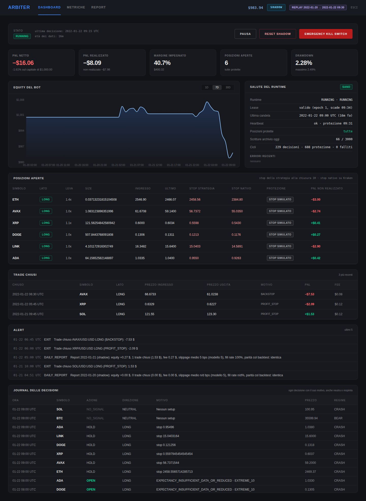

# PHASE REPORT — F6

```
PHASE REPORT
Fase: F6 — Osservabilità e dashboard
Obiettivo: log JSON con correlation id, journal di ogni decisione, alert sugli eventi richiesti con
           canale esterno, health autenticato, dashboard con soli dati reali (D31), report
           giornaliero con PnL, costi, slippage, fill rate e divergenze dal backtest.
Esito gate: PASS (test delle metriche con casi calcolati a mano; screenshot della dashboard in shadow)
```

## File creati/modificati

| Area | File |
|---|---|
| Log | `src/engine/ops/logger.ts` (una riga JSON per evento; `cycleId` del ciclo in corso, `positionId`, `cliOrdId`; segreti della configurazione oscurati; errori recenti per l'health) |
| Alert | `src/engine/ops/alertChannels.ts` (Telegram, webhook, deduplica, fanout), `src/engine/ops/alerts.ts` (riga di log con i correlation id, registro unico degli alert, codici `HEARTBEAT_MISSING`, `DAILY_REPORT`, `TEST`) |
| Heartbeat | `src/engine/runtime/heartbeat.ts`, `scheduler.ts` (registra ogni ciclo), `server.ts` (watchdog con timer proprio) |
| Health | `BotRuntime.health()`; stato di protezione di ogni posizione con il prezzo dello stop confermato su Kraken (`krakenExecutionPort.ts`: `stopOnExchange`) |
| Metriche | `src/engine/ops/metrics.ts` (calcolate sul server dagli stessi dati del ledger del bot, confrontate con il ledger di Kraken) |
| Report giornaliero | `src/engine/ops/dayTracker.ts` (statistiche del giorno), `dayParity.ts` (replay del giorno dal checkpoint del core e confronto), `dailyReport.ts`; `src/engine/live/decisionCycle.ts` (fill applicati con prezzo di riferimento, fase e slot); `botStore.ts` (report, checkpoint, journal per intervallo, ledger per giorno, pulizia dello storico al reset dello shadow) |
| Core (solo journal) | `decisionCore.ts`: record `NO_DATA` per un simbolo non valutato all'ora (candela mancante o storico insufficiente). Decisioni invariate |
| Ordini | `orderManager.ts`: transizioni nel log; D44 |
| API | `src/server/app.ts`: `GET /api/health/details`, `POST /api/alerts/test`, `GET /api/reports/daily`, `GET /api/reports/daily/:day` (admin); `/api/cron/tick` risponde 503 se l'heartbeat manca; rimosso il mock `/api/system/state` |
| Dashboard | `src/Dashboard.tsx` riscritta (sotto); `scripts/dashboard/replayServer.ts` (`npm run dashboard:replay`: dashboard su dati storici reali in replay, con il badge REPLAY) |
| Archivio | `src/lib/{metricsCalculator,quantEngine,ml,ledgerTypes}.ts` → `archive/legacy_ui/` (calcolo lato client con unità errate, codice inutilizzato); `tests/metrics/metricsCalculator.test.ts` rimosso con il modulo, sostituito da `tests/ops/metrics.test.ts` |
| Test | `tests/ops/{logger,alertChannels,metrics,dailyReport,dayParity}.test.ts`, `tests/runtime/{heartbeat,observability,dailyReport}.test.ts`; aggiornati `app.test.ts`, `dashboardWiring.test.ts`, `operations.test.ts`, `persistence.test.ts`, `killSwitch.test.ts`, `world.ts` |

## Cosa c'è ora

**Log e journal.** Ogni riga è JSON (`type`, `level`, `at`, `message`, poi `cycleId`, `positionId`, `cliOrdId`, poi il contesto). Il runtime imposta il ciclo in corso (`D-` decisione, `P-` protezione, `K-` kill switch, `R-` recovery, `C-` comandi): intento, ordini, stop e alert scritti nello stesso ciclo ne portano l'id. Le transizioni degli ordini sono nel log con `cliOrdId` e `positionId`. Chiavi, token, URL del webhook e chiave del service account non compaiono mai (sostituiti con `[REDACTED]`, anche nella forma con l'escape JSON). Il journal ha un record per ogni simbolo a ogni chiusura oraria: segnali neutri (`NO_SIGNAL`), blocchi, ingressi respinti dal guardrail o dall'exchange (`REJECTED`, dal runtime) e simboli senza dati (`NO_DATA`, dal core).

**Alert.** Ingresso (in shadow dal runtime, in demo/live dalla porta Kraken con il `cliOrdId`), uscita, errore di esecuzione, stop mancante o ripristinato, desync, dati fermi, lease perso, kill switch, heartbeat mancante (nuovo), limiti di rischio, report giornaliero. Sempre sul log; in più su Telegram (`sendMessage` del Bot API) o webhook. Un canale che fallisce non blocca gli altri; alert identici ripetuti entro 10 minuti non vengono reinviati sul canale (il primo invio dopo riporta quante volte si sono ripetuti). `POST /api/alerts/test` prova il canale.

**Heartbeat.** Lo scheduler registra la fine di ogni ciclo; protezione ferma da più di 90 s o decisione ferma da più di 20 minuti → alert critico `HEARTBEAT_MISSING` (una volta, e un alert di ritorno alla normalità). Lo controllano sia un watchdog con timer proprio sia il cron esterno: `/api/cron/tick` risponde 503, così il servizio di cron segnala da solo anche il processo morto o bloccato.

**Health (`GET /api/health/details`, admin).** Modalità, stato del runtime e operativo, lease (holder, epoch, scadenza, validità), ultima candela ed età, cicli, heartbeat, ogni posizione con stato dello stop nativo e prezzo dello stop su Kraken, posizioni sconosciute, persistenza e scritture del giorno, ultimi 20 warning/errori (log e alert), `healthy` e l'elenco dei problemi.

**Metriche (lato server, D31).** PnL netto/realizzato/non realizzato; trade (profit factor null se non ci sono perdite, invece di un 99,9 finto); drawdown massimo e attuale; **tempo sott'acqua** (somma dei periodi sotto il massimo) e **durata massima di un drawdown** (il periodo più lungo) come misure distinte, in millisecondi; Sharpe e Sortino solo con almeno 30 giorni di rendimenti giornalieri. Controllo di coerenza: PnL dei trade = equity realizzata − capitale; fee e funding del bot contro il ledger di Kraken (demo/live). Dopo un riavvio trade, equity e journal si ricaricano dall'archivio (prima la dashboard ripartiva vuota e le metriche usavano solo gli ultimi 20 trade).

**Report giornaliero** (a fine giorno UTC, in `reports/daily-<giorno>`, alert `DAILY_REPORT`, API e tab "Report"): equity inizio/fine e drawdown del giorno, PnL e trade, fee e funding del bot contro quelli dell'account log di Kraken, slippage rispetto al modello (5 bps) separato tra decisioni e stop nativi (per gli stop i gap sono eventi di mercato: riportati senza giudizio), esito di ogni ingresso deciso (eseguito, parziale, non eseguito, respinto dal guardrail, tardivo) e fill rate, alert del giorno, confronto con il backtest e l'elenco dei punti da verificare.

**Confronto con il backtest sugli stessi dati.** A inizio giorno si salva lo stato del core (checkpoint). A fine giorno il giorno si rigioca con il codice del backtest sulle candele definitive, uno slot alla volta, respingendo gli stessi intenti respinti dal bot: in shadow con il modello di esecuzione del backtest (si confrontano decisioni e trade), in demo/live con i fill reali di Kraken negli stessi slot (si confrontano le decisioni; lo scostamento dei prezzi è lo slippage). Ogni differenza è "spiegata" se la candela mancava al momento della decisione o nello storico recente del simbolo (o di BTC, che dà il regime a tutti); altrimenti è una divergenza non spiegata. In demo/live il report aspetta una lettura dell'account log successiva alla mezzanotte.

**Dashboard.** Solo dati reali: rimosso il mock `/api/system/state` e i valori fissi (nome d'istanza, "OPERATIONAL", sessione, performance out-of-sample, `\n` letterale). Badge della modalità (SHADOW / DEMO / LIVE, e REPLAY quando i dati non sono di Kraken dal vivo), banner con i problemi (health, stato operativo, blocco giornaliero, pausa), comandi (pausa/ripresa, ripresa dopo REDUCE_ONLY/HALTED, reset solo in shadow, kill switch), KPI, salute del runtime, equity, posizioni con stop della strategia, stop nativo e stato di protezione, trade con fee, alert, journal; tab "Metriche" (con l'alert di prova) e "Report" (report giornalieri e confronto con il backtest, differenza per differenza). Orari in UTC.

## Difetti chiusi (ID → test che lo prova)

| ID | Chiusura | Test |
|---|---|---|
| D31 | Mock `/api/system/state` rimosso (la dashboard non lo usa più; la rotta risponde 404); "tempo sott'acqua" e "durata massima del drawdown" sono misure diverse, calcolate sul server in ms e mostrate con la stessa unità; `\n` letterale e valori fissi rimossi | `app.test.ts` "rotte pubbliche e rimosse", `metrics.test.ts` "D31: tempo sott'acqua… e durata massima…", `dashboardWiring.test.ts` "D31: niente dati finti…" |

## Nuovi difetti trovati

| ID | Stato | Descrizione e test |
|---|---|---|
| D44 | Chiuso | In demo/live la riconciliazione di uno stop aperto (a ogni ciclo di protezione, ogni 20 s) registrava una transizione ACKNOWLEDGED → ACKNOWLEDGED: una voce di storico e una riscrittura dell'ordine su Firestore ogni volta. Misurato: 1.445 voci in 24 ore per un solo stop; con 8 posizioni ~35.000 scritture al giorno e documenti che crescono fino al limite di 1 MiB. Le scritture di F4 erano misurate solo in shadow. Ora una riconciliazione che non cambia nulla non scrive. Test: "scritture Firestore in demo su 24 ore con posizioni aperte (D44)…" (fallisce senza la correzione) |
| D45 | Chiuso | Gli alert inviati dalla porta Kraken e dallo StopManager (es. `STOP_MISSING`, `DESYNC`) non arrivavano nell'elenco degli alert recenti del runtime, quindi né in dashboard né nell'health. Ora un registro unico raccoglie gli alert di tutti i componenti. Test: "health in demo: … stop impossibile da piazzare → non sano" |
| D46 | Chiuso | Dopo un riavvio la dashboard ripartiva vuota (trade, equity, journal solo in memoria) e le metriche del client usavano gli ultimi 20 trade: PnL e statistiche incoerenti con l'equity. Ora lo storico si ricarica dall'archivio e le metriche usano tutti i trade dello stato. Test: "demo: report dopo la lettura del ledger… sopravvive al riavvio" (`ledgerCheck.consistent` dopo il riavvio) |
| D47 | Chiuso | Il journal non registrava nulla per un simbolo senza candela all'ora o con storico insufficiente: una decisione silenziosa. Ora c'è un record `NO_DATA` con il motivo. Test: "journal: a ogni chiusura oraria un record per ogni simbolo…" |

## Gate

| Criterio | Esito |
|---|---|
| Test sulle metriche con casi che possono fallire | PASS — `metrics.test.ts` (7 casi calcolati a mano: profit factor 130/70, drawdown 9,09%, tempo sott'acqua 4 h contro durata massima 3 h, Sharpe con la formula scritta nel test, coerenza con un trade mancante), `dailyReport.test.ts` (slippage, fill rate, fee contro Kraken, equity), `dayParity.test.ts` (identico / spiegato / divergente); report nel runtime: shadow IDENTICO su due giorni, candela di BTC pubblicata in ritardo → differenza trovata e spiegata, demo con riavvio a metà giornata → IDENTICO, fee del bot uguali all'account log |
| Screenshot della dashboard in shadow | PASS con due immagini: `F6_replay_dashboard.jpg`, `F6_replay_metriche.jpg`, `F6_replay_report.jpg` (shadow su dati storici reali in replay, 20-22 gennaio 2022, con 6 posizioni aperte: la rete verso Kraken qui non c'è) e `F6_shadow_senza_rete_dashboard.jpg` (il server shadow vero, avviato qui: nessuna candela, Firestore non raggiungibile tra gli errori recenti) |



## Comandi eseguiti ed esito

| Comando | Esito |
|---|---|
| `npm run typecheck` | PASS |
| `npm test` | PASS — 332/332 (il file di test del vecchio calcolatore lato client è stato rimosso con il modulo; le metriche nuove hanno i loro test) |
| `npm run build` | PASS |
| `npm run golden:check` | identico (legacy ed engine) |
| `npm run replay:parity` | IDENTICO su tutte le finestre; sul mercato sintetico il journal ha 489 record `NO_DATA` in più (candele mancanti del dataset sintetico), identici tra backtest e replay |
| Scritture misurate su 24 ore | shadow 1.587, demo con posizioni aperte 1.613 (budget 3.000) |
| `npm run dashboard:replay` + Chromium | screenshot sopra |
| Telegram e webhook reali | NON ESEGUITO: rete verso api.telegram.org e verso Kraken bloccata qui; formato verificato con un client HTTP finto nei test. Va provato con `POST /api/alerts/test` |

## Metriche backtest

Non toccate: decisioni, golden e parità invariati. Il core scrive in più solo i record di journal `NO_DATA`.

## Default della sezione 2 applicati

`ALERT_CHANNEL=telegram` è il default della sezione 2 ma richiede token e chat: senza, la configurazione resta `none` (solo log) in shadow e demo; in live gli alert sono obbligatori (F1). L'opzione `email` della sezione 2 non è implementata (serve un server SMTP): un webhook verso un servizio di email la sostituisce. Scelte dichiarate: deduplica degli alert identici 10 minuti; heartbeat: protezione 90 s, decisione 20 minuti; watchdog ogni 60 s; slippage del modello 5 bps (profilo realistico); report giornaliero in UTC; storico delle candele mancanti tenuto 45 giorni (quanto la finestra delle feature 4H).

## Rischi residui

- Canali di alert mai provati contro Telegram/webhook veri (rete): da provare con l'alert di prova prima del live (F8, checklist).
- Il confronto giornaliero scarica 50 giorni di candele per rigiocare il giorno (una volta al giorno, fuori dal lock dei cicli); se Kraken non risponde il report esce con il confronto "non disponibile" e il motivo.
- In demo/live il confronto usa i fill reali: verifica le decisioni, non il modello di esecuzione (per quello c'è lo slippage). Una candela modificata da Kraken dopo la pubblicazione risulta come divergenza non spiegata (è voluto: va guardata).
- Il report conta gli alert del giorno dalla memoria del processo (ultimi 100): dopo un riavvio quelli precedenti non ci sono.
- La dashboard non ha test nel browser (nel progetto non c'è un ambiente DOM): il collegamento dei pulsanti è verificato sul sorgente e le API nei test del server.

## Coerenza con mastrot_memo.md

Aggiornato (sezione 6, F6). Strategia invariata; il core aggiunge solo record di journal. Osservabilità e report stanno fuori dal core (runtime e `src/engine/ops`), come il resto dell'infrastruttura.

## Esito gate

**PASS.**
